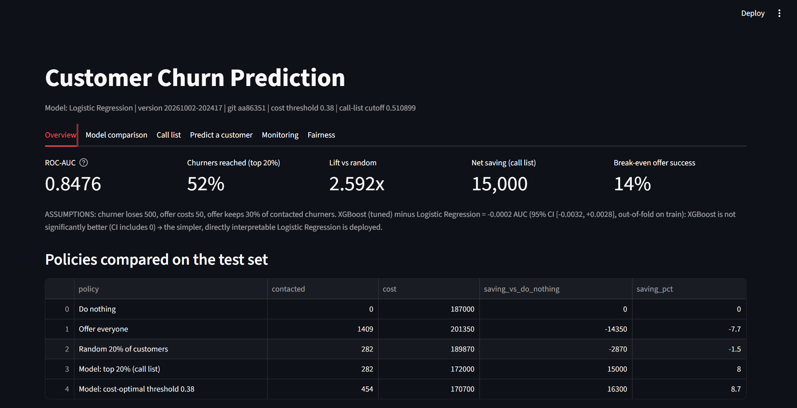
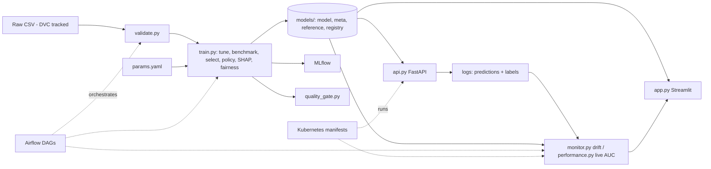
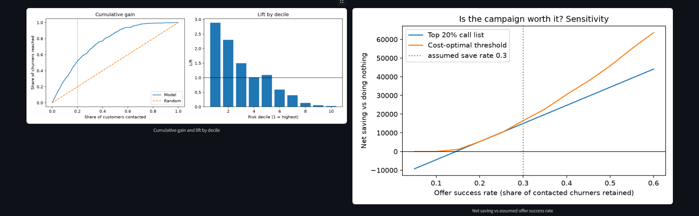
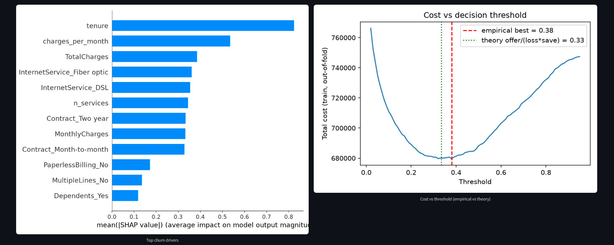
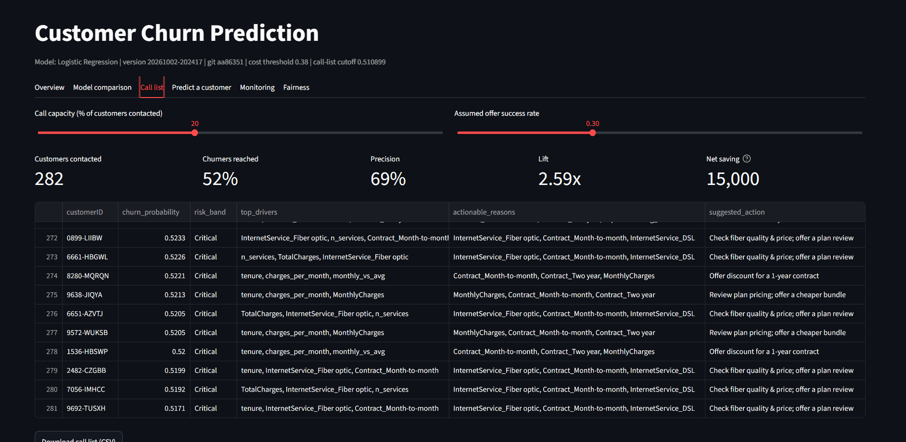
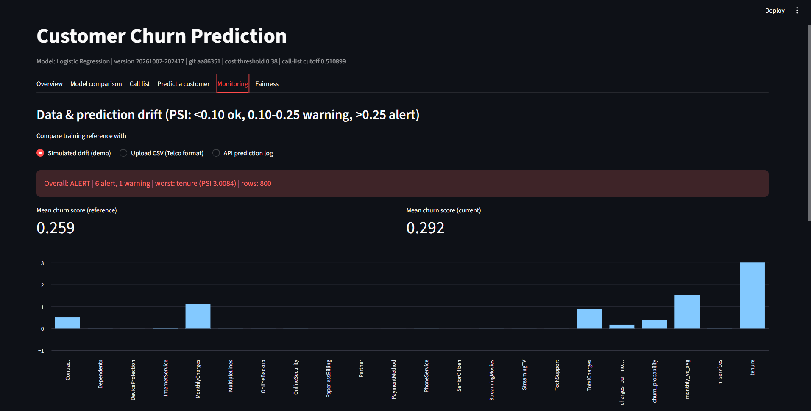
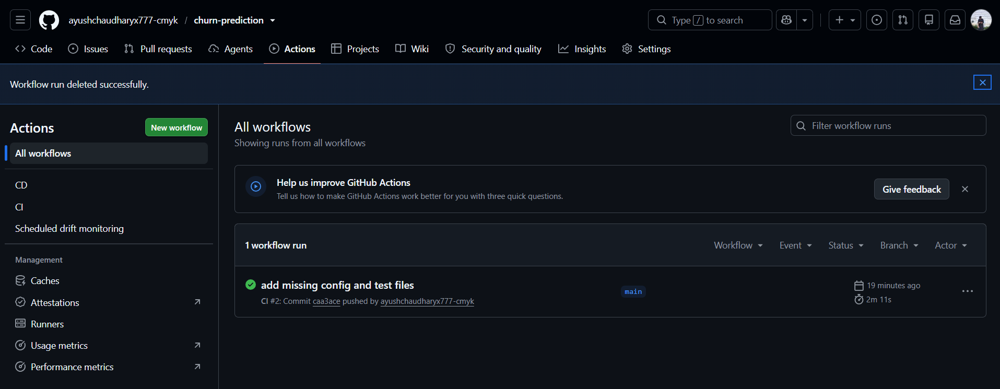

# Customer Churn Prediction - end-to-end ML + MLOps


**API docs:** `/docs` | **One-pager:** [`reports/ONE_PAGER.md`](reports/ONE_PAGER.md)

Predict which telecom customers will churn, decide **who to contact under a limited budget**, explain each
prediction with **actionable reasons**, serve it via an API, **monitor drift and live performance**, and ship it with
**CI/CD, Docker, DVC, Airflow and Kubernetes** definitions.





## What is in the box
| Level | Feature | Where |
|---|---|---|
| Core | Validation, leakage-safe pipelines, tuned XGBoost vs LR vs RF | `validate.py`, `train.py` |
| Tier 1 | Honest economics (do-nothing / offer-everyone / random baselines), break-even success rate, sensitivity | `policy.py`, `reports/RESULTS.md` |
| Tier 1 | Calibration (Brier, ECE), no class re-weighting | `train.py` |
| Tier 1 | Capacity targeting: precision/recall/lift @ top-K, gain & lift chart, call list | `reports/gain_lift.png`, Call-list tab |
| Tier 1 | Bootstrap CIs + **model selection by paired bootstrap** (simpler model wins ties) | `train.py` |
| Tier 1 | **Actionable** reasons only (not tenure/demographics) -> per-customer retention action | `features.py`, `explain.py` |
| Tier 2 | Live demo (Streamlit Cloud), fairness audit, scheduled drift workflow, live-performance monitoring (`/feedback`), screenshots, one-pager | see below |
| Tier 3 | DVC pipeline, Airflow DAGs, Kubernetes manifests, PyTorch MLP + stacking benchmarks | `dvc.yaml`, `airflow/`, `k8s/`, `deep.py` |
| Ops | MLflow, model registry + versions, CI (lint, tests, k8s schema, docker build), CD to GHCR, Docker | `.github/`, `Dockerfile` |

## Quick start
```bash
python -m venv venv && venv\Scripts\activate            # Linux/Mac: source venv/bin/activate
pip install -r requirements-train.txt                    # + requirements-extras.txt for torch & dvc
# put the Kaggle Telco CSV at data/WA_Fn-UseC_-Telco-Customer-Churn.csv
python train.py                                          # ~5-10 min with challengers (SKIP_CHALLENGERS=1 to skip them)
streamlit run app.py                                     # dashboard
uvicorn api:app --reload                                 # API docs at http://localhost:8000/docs
mlflow ui --backend-store-uri sqlite:///mlflow.db        # experiment tracking
python -m pytest -q                                      # tests (pip install -r requirements-dev.txt)
```
No Kaggle access? `python scripts/make_synthetic_data.py` makes a **synthetic** file for testing. Never report numbers from it.

## Decision policy (the important part)
Everything below is driven by **assumptions you set in `params.yaml`** (loss per churner 500, offer cost 50,
offer success rate 30%, contact capacity 20%). The dashboard lets you move capacity and success rate live.
Contact a customer only if `p * save * loss > offer` (threshold = offer / (loss * save)). The report shows the model
call list vs **do nothing, offer everyone, and random targeting**, plus the **break-even offer success rate** -
the honest answer to "is the campaign worth it?".

## API
```bash
curl -X POST localhost:8000/predict -H "Content-Type: application/json" -d '{
 "SeniorCitizen":0,"Partner":"No","Dependents":"No","tenure":3,"PhoneService":"Yes","MultipleLines":"No",
 "InternetService":"Fiber optic","OnlineSecurity":"No","OnlineBackup":"No","DeviceProtection":"No",
 "TechSupport":"No","StreamingTV":"Yes","StreamingMovies":"Yes","Contract":"Month-to-month",
 "PaperlessBilling":"Yes","PaymentMethod":"Electronic check","MonthlyCharges":95.5,"TotalCharges":280}'
# later, when you learn what really happened:
curl -X POST localhost:8000/feedback -H "Content-Type: application/json" -d '{"request_id":"<id from /predict>","churned":true}'
```
`/predict` returns probability, risk band (Critical = in the call list), top drivers, **actionable reasons** and a retention action.

## Monitoring
```bash
python monitor.py --simulate                         # demo: drifted customers -> ALERT (exit code 1)
python monitor.py --current logs/predictions.jsonl   # real API traffic vs training reference (PSI + KS)
python performance.py                                # live AUC once /feedback labels exist (exit 1 if degraded)
```
Scheduled version: `.github/workflows/monitor.yml` checks `monitoring/current.csv` daily and opens an issue on ALERT.

## Tier 3 extras (what they are, honestly)
- **DVC:** first delete the `data/` line from `.gitignore`, then `dvc init && dvc add data/WA_Fn-UseC_-Telco-Customer-Churn.csv`, `dvc remote add -d storage ../dvc-storage`,
  `dvc repro`, `dvc push`. Change `params.yaml` -> `dvc repro` -> `dvc metrics diff`. A teammate does `git clone` + `dvc pull`.
  (With DVC, `data/` must NOT be in the root `.gitignore` - DVC creates `data/.gitignore` itself; I verified push, fresh clone, `dvc pull` and `dvc repro`.)
- **Airflow:** `airflow/dags/churn_pipeline.py` - weekly train->gate, daily monitoring. Needs WSL2/Docker on Windows.
- **Kubernetes:** `docker build --target baked -t churn-api:1.0 .`, then `kubectl apply -k k8s/` (kind/minikube).
  Manifests pass schema validation in CI; not operated on a production cluster.
- **Deep learning / stacking:** `deep.py` (PyTorch MLP) and a stacking ensemble are **benchmarks** in `reports/RESULTS.md`.
  They are not deployed unless significantly better, because per-customer reasons need an explainable model.

## Docker
```bash
docker compose up --build        # API :8000 + dashboard :8501 (models/ mounted)
```

## CI/CD
- `ci.yml` on every push: `ruff`, `pytest` (trains a model on synthetic data, tests API/drift/policy), Kubernetes schema check, `docker build`.
- `cd.yml` on a tag: `git tag v1.0.0 && git push --tags` -> image on `ghcr.io/<username>/churn-prediction`.

## Results






**Deployed model:** Logistic Regression. Tuned XGBoost was not significantly better (AUC difference -0.0002, 95% CI [-0.0032, +0.0028], out-of-fold), so the simpler, interpretable model was chosen.

| Metric (test set) | Value |
|---|---|
| ROC-AUC | 0.8476 |
| Churners reached by top-20% call list | 52% (precision 69%, lift 2.59x) |
| Break-even offer success rate | 14% |

**Business impact (assumed: churner loses 500, offer costs 50, offer keeps 30% of contacted churners):**

| Policy | Contacted | Saving vs do nothing |
|---|---|---|
| Offer everyone | 1409 | -14,350 |
| Random 20% | 282 | -2,870 |
| Model: top 20% call list | 282 | +15,000 (8%) |
| Model: cost-optimal threshold 0.38 | 454 | +16,300 (8.7%) |

**Key insights**
- The model is what makes the campaign profitable: offering everyone or contacting randomly loses money.
- Logistic Regression, tuned XGBoost and stacking perform the same (AUC within +/-0.003), so the features carry the signal, not the algorithm.
- Probabilities are well calibrated, so scores can be read as probabilities.
- Gender is not a model input; flag rates are near-identical across genders (ratio 0.99). Senior citizens are flagged ~2x as often, which matches their ~1.9x higher churn rate; recall is higher for seniors (81% vs 66%) but ranking quality is lower (AUC 0.78 vs 0.85, n=222, noisy).
- The suggested action for each customer comes from their top actionable churn driver.
- Savings depend entirely on the assumed offer success rate; the campaign only pays off above ~14%.

## Limitations
- Economics are assumptions; no real campaign data. Static snapshot, so no out-of-time validation.
- Explanations are correlational; retention actions are rules, not learned uplift.
- Fairness audit covers gender and senior-citizen only.
- Airflow/Kubernetes/DVC-remote are demo-grade here (validated, not run in production).

## Structure
```
features.py validate.py policy.py explain.py train.py deep.py api.py monitor.py performance.py app.py
params.yaml dvc.yaml  airflow/dags/  k8s/  scripts/  tests/  docs/  monitoring/
Dockerfile docker-compose.yml  .github/workflows/{ci,cd,monitor}.yml  requirements*.txt  pyproject.toml
```
